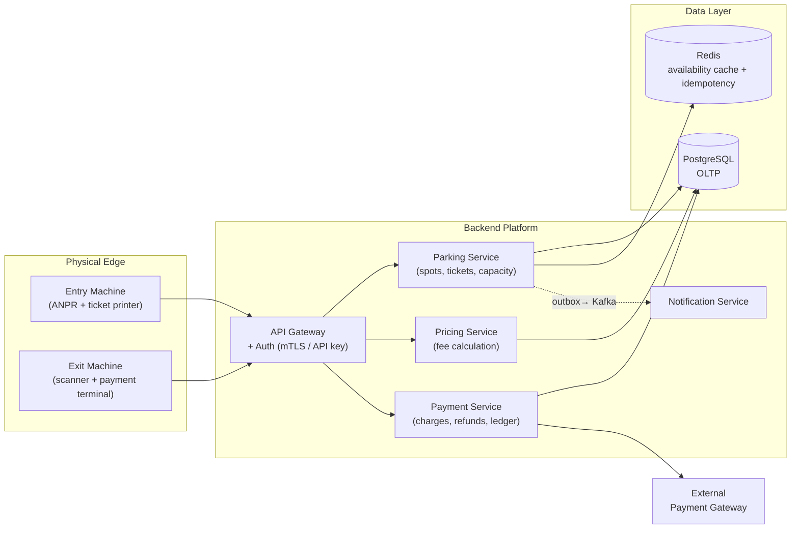
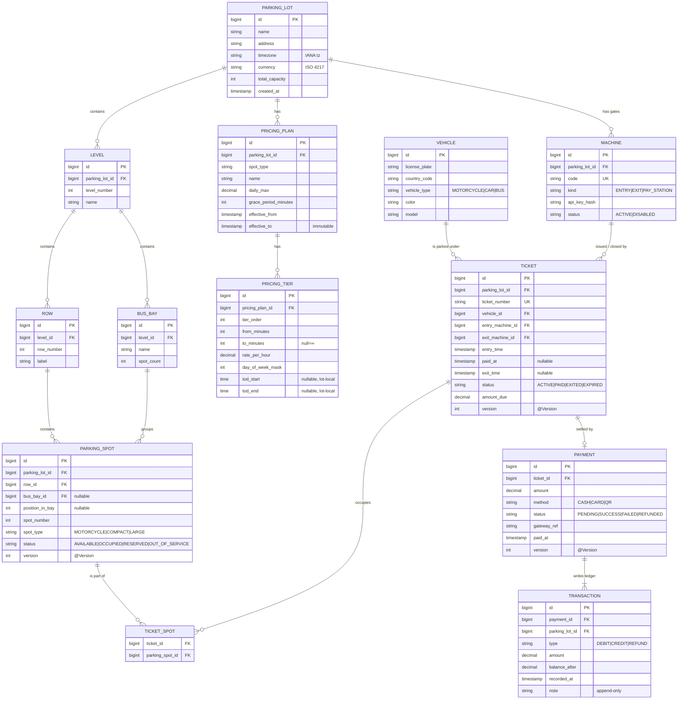
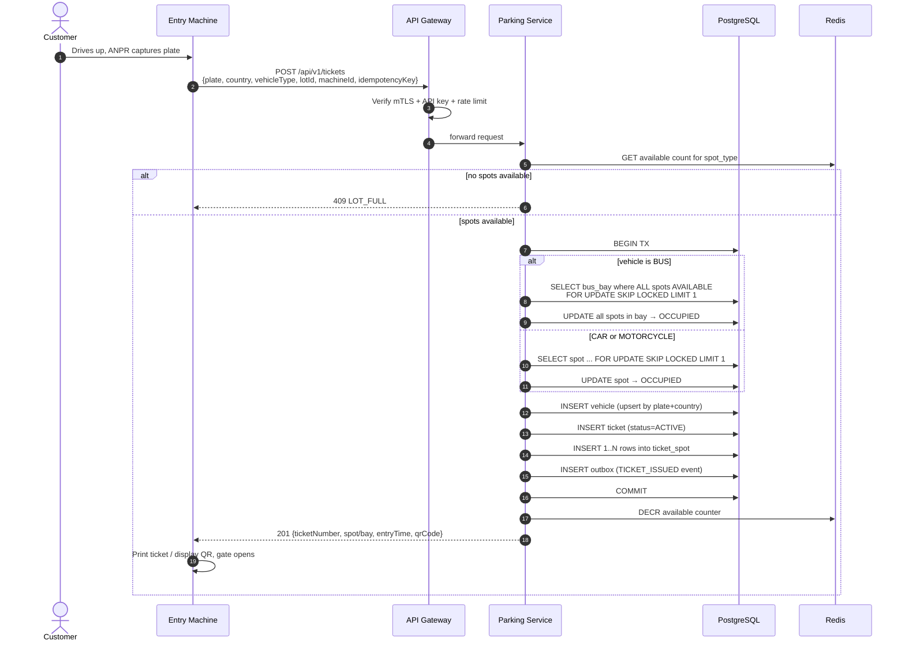
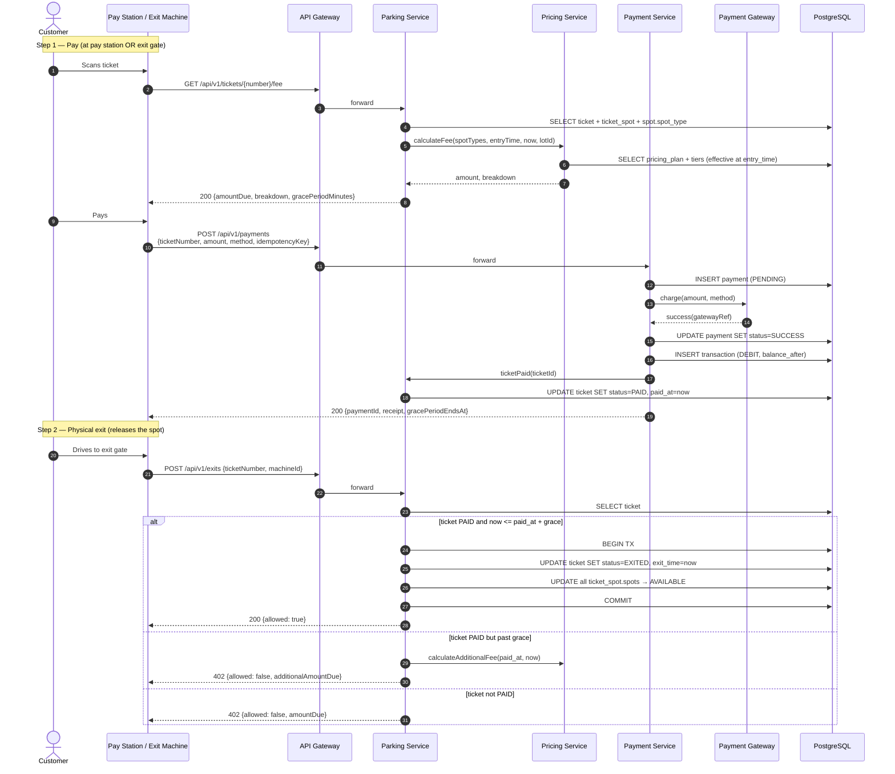

# Parking Lot System — Design

## 1. Overview

A multi-level parking system supporting motorcycles, cars, and buses across heterogeneous spot sizes, with automated entry, payment, and exit handled by edge kiosks integrating with a backend platform.

### Functional requirements

- Multi-level lot structure: lot → level → row → spot.
- Three vehicle classes (motorcycle, car, bus) and three spot sizes (`MOTORCYCLE`, `COMPACT`, `LARGE`).
- Capacity tracking and availability reporting.
- Per-spot-type, time-bounded pricing.
- Machine-to-machine APIs for entry kiosks and pay/exit stations.

### Non-functional assumptions

- ~10 lots, up to 5 levels each, ~2,000 spots per lot.
- Peak: ~10 entry/exit events per second per lot.
- Strong consistency on spot assignment.
- Eventual consistency for reporting.
- All timestamps stored as UTC (`TIMESTAMPTZ`); evaluated and displayed in lot-local time via `PARKING_LOT.timezone`.

### Scale envelope

100 events/sec backend-wide steady-state, ~500 events/sec at peak. Single PostgreSQL primary with read replicas; no sharding required.

### Domain glossary

| Term | Definition |
|---|---|
| **ANPR** | Automatic Number Plate Recognition — camera + OCR used at entry/exit kiosks to read license plates without manual input. |
| **Bus bay** | A pre-defined group of contiguous `LARGE` spots reserved for buses. Established at lot provisioning so allocation is constant-time at runtime. |
| **Pay station** | A standalone payment kiosk inside the lot, separate from the exit gate. Customers can pay before walking back to their car, reducing exit-gate queueing. |
| **Grace period** | A free time buffer after payment (default 15 minutes) during which the customer may exit without further charge. Absorbs the delay between paying and reaching the gate. |
| **Daily max** | Maximum amount charged per 24-hour period, regardless of accumulated hourly tier rates. Configured per `PRICING_PLAN`. |
| **TPM / Secure element** | Tamper-resistant hardware on the kiosk that stores cryptographic private keys, preventing extraction even with physical access to the device. |

---

## 2. System Architecture



### Service responsibilities

- **Parking Service** — source of truth for spots, tickets, and capacity. All state transitions on physical resources flow through this service.
- **Pricing Service** — stateless fee calculation over rules and duration. Independently deployable for pricing changes.
- **Payment Service** — sole integration point with the external payment gateway and the only writer to the financial ledger. Compliance boundary.
- **Notification Service** — consumes domain events from the outbox stream for SMS / email / push delivery.
- **Redis** — hot-path availability counters (`lot:{id}:available:{spot_type}`) and idempotency-key cache. PostgreSQL remains the source of truth.

---

## 3. Data Model



### Modeling decisions

1. **Spot type is a property of the spot, not the vehicle.** `PARKING_SPOT.spot_type` describes the physical infrastructure; vehicle-to-spot compatibility is enforced at assignment time as a service-layer rule.

2. **`TICKET ↔ PARKING_SPOT` is many-to-many** via `TICKET_SPOT`. A bus consumes multiple spots under one ticket; cars and motorcycles consume one.

3. **`BUS_BAY` pre-models contiguous bus parking.** Five `LARGE` spots are grouped into a named bay during lot provisioning. Bus entry assigns a bay, eliminating runtime contiguous-spot search.

4. **Optimistic concurrency via `@Version`** is applied to `PARKING_SPOT`, `TICKET`, and `PAYMENT` — the rows where independent actors race. `TRANSACTION` is append-only. `PRICING_PLAN` and `PRICING_TIER` are immutable by convention; new rules replace old.

5. **`parking_lot_id` is denormalized** onto `PARKING_SPOT`, `TICKET`, and `TRANSACTION` for partitioning, per-lot reporting, and future tenant scoping.

6. **`PRICING_PLAN` + `PRICING_TIER`** supports tiered rates, time-of-day variation, day-of-week masks, daily caps, and grace periods. Both tables are time-bounded and treated as append-only.

7. **License plate is not enforced unique.** Plates collide across countries and are reissued domestically; `(license_plate, country_code)` is used for matching but not as a uniqueness constraint.

8. **Currency lives on `PARKING_LOT`.** Single currency per lot.

### Vehicle-to-spot compatibility

| Vehicle | Allowed spot types | Spots per ticket |
|---|---|---|
| Motorcycle | `MOTORCYCLE`, `COMPACT`, `LARGE` | 1 |
| Car | `COMPACT`, `LARGE` | 1 |
| Bus | `LARGE` (bay member) | All spots in 1 bay |

### Capacity tracking

- **Authoritative**: `SELECT COUNT(*) FROM parking_spot WHERE status='AVAILABLE' AND spot_type=?`.
- **Hot path**: Redis counter `lot:{id}:available:{spot_type}`, decremented on assignment, incremented on release. Reconciled to the database every minute.

---

## 4. Key Flows

### 4.1 Issue Parking Ticket



`SELECT … FOR UPDATE SKIP LOCKED` is used because spots and bays are fungible — concurrent transactions need *any* available row, not a specific one. Skipping locked rows prevents kiosks from queuing on each other.

### 4.2 Pay and Exit

Payment and physical exit are decoupled. Payment closes the financial loop; the spot is released only on physical exit. A grace period (default 15 minutes) after payment allows the customer time to leave without further charge.



---

## 5. API Specification

Base path: `/api/v1`. JSON over HTTPS with mTLS for machine clients. All write endpoints accept an `Idempotency-Key` header.

### Idempotency-Key TTLs

| Endpoint | TTL |
|---|---|
| `POST /tickets` | 15 minutes |
| `POST /exits` | 15 minutes |
| `POST /payments` | 1 hour |

Keys are stored in Redis with the original response. Duplicate detection beyond the TTL is enforced by ticket and payment state machines (e.g., `TICKET_ALREADY_PAID`).

### 5.1 Issue a ticket

```
POST /api/v1/tickets
Headers: X-Machine-Key, Idempotency-Key
```
```json
// Request
{
  "licensePlate": "29A-12345",
  "countryCode": "VN",
  "vehicleType": "CAR",
  "parkingLotId": 1,
  "entryMachineId": 11
}
```
```json
// 201 Created
{
  "ticketId": 90122,
  "ticketNumber": "T-2026-0001234",
  "spotIds": [4567],
  "spotLocation": { "level": 2, "row": "B", "spot": 14 },
  "entryTime": "2026-05-09T08:14:22Z",
  "qrCode": "data:image/png;base64,..."
}
```

Errors: `409 LOT_FULL`, `409 NO_SPOT_FOR_VEHICLE_TYPE`, `409 NO_BUS_BAY_AVAILABLE`, `400 INVALID_PLATE`, `401 UNAUTHENTICATED`, `429 RATE_LIMITED`.

### 5.2 Look up ticket / current fee

```
GET /api/v1/tickets/{ticketNumber}
GET /api/v1/tickets/{ticketNumber}/fee
```
```json
// 200 OK — /fee
{
  "ticketNumber": "T-2026-0001234",
  "entryTime": "2026-05-09T08:14:22Z",
  "currentTime": "2026-05-09T11:42:08Z",
  "durationMinutes": 208,
  "currency": "VND",
  "amountDue": 75000,
  "gracePeriodMinutes": 15,
  "breakdown": [
    { "tier": "first hour", "minutes": 60,  "rate": 25000, "subtotal": 25000 },
    { "tier": "hours 2-4",  "minutes": 148, "rate": 18750, "subtotal": 50000 }
  ]
}
```

### 5.3 Record a payment

```
POST /api/v1/payments
Headers: X-Machine-Key, Idempotency-Key
```
```json
// Request
{
  "ticketNumber": "T-2026-0001234",
  "amount": 75000,
  "method": "CARD",
  "gatewayRef": "stripe_pi_3OqXyZ..."
}
```
```json
// 201 Created
{
  "paymentId": 55001,
  "transactionId": 90871,
  "ticketStatus": "PAID",
  "gracePeriodEndsAt": "2026-05-09T11:57:35Z",
  "receiptUrl": "https://api.parking.example/receipts/55001.pdf",
  "paidAt": "2026-05-09T11:42:35Z"
}
```

Errors: `400 AMOUNT_MISMATCH`, `404 TICKET_NOT_FOUND`, `409 TICKET_ALREADY_PAID`, `502 GATEWAY_UNAVAILABLE`.

### 5.4 Mark exit

```
POST /api/v1/exits
```
```json
// Request
{ "ticketNumber": "T-2026-0001234", "exitMachineId": 22 }

// 200 OK — within grace
{ "allowed": true, "exitTime": "2026-05-09T11:43:01Z" }

// 402 — past grace, additional fee due
{ "allowed": false, "reason": "GRACE_EXPIRED", "additionalAmountDue": 25000 }

// 402 — never paid
{ "allowed": false, "reason": "TICKET_NOT_PAID", "amountDue": 75000 }
```

### 5.5 Availability

```
GET /api/v1/parking-lots/{id}/availability
```
```json
{
  "parkingLotId": 1,
  "totalSpots": 1840,
  "available": { "MOTORCYCLE": 220, "COMPACT": 410, "LARGE": 65 },
  "busBaysAvailable": 4,
  "byLevel": [
    { "level": 1, "available": 215 },
    { "level": 2, "available": 230 }
  ]
}
```

### 5.6 Admin

```
POST   /api/v1/admin/parking-lots                 # provision new lot + layout
POST   /api/v1/admin/pricing-plans                # new plan; expires the prior
PATCH  /api/v1/admin/parking-spots/{id}           # OUT_OF_SERVICE / restore
GET    /api/v1/admin/transactions?from=&to=&lotId=
POST   /api/v1/admin/payments/{id}/refund
PATCH  /api/v1/admin/machines/{id}                # disable compromised machine
```

---

## 6. Cross-Cutting Concerns

| Concern | Approach |
|---|---|
| **Machine authentication** | Per-machine API key (hashed at rest) inside mTLS. Private keys held in TPM / secure element on the kiosk. Quarterly rotation. |
| **Rate limiting** | Per-machine limits at the gateway. Anomaly detection on issuance rate; remote kill-switch endpoint for compromised machines. |
| **Idempotency** | Redis-backed per-endpoint TTLs (§5). State-machine checks are the primary duplicate defense. |
| **Spot/bay assignment concurrency** | `SELECT … FOR UPDATE SKIP LOCKED` on the candidate row, plus `@Version` optimistic locking on `PARKING_SPOT`, `TICKET`, `PAYMENT`. |
| **Optimistic-lock retry** | On `OptimisticLockException`, retry 1–2 times with 10–50 ms jittered backoff (Spring Retry) before returning `409 Conflict`. |
| **Pricing changes** | `PRICING_PLAN` and `PRICING_TIER` are append-only. New plan inserted; previous plan's `effective_to` updated. Fees use the plan effective at `entry_time`. |
| **Grace period** | `paid_at + grace_period_minutes`. Within: free exit. After: re-charge for additional time. Configurable per plan. |
| **Time zones** | All timestamps `TIMESTAMPTZ` (UTC). Time-of-day pricing rules evaluated against `PARKING_LOT.timezone`. |
| **Currency** | Single currency per lot, on `PARKING_LOT.currency` (ISO 4217). |
| **Outbox pattern** | State-changing transactions write a row to `outbox` in the same DB transaction. A separate poller publishes to Kafka and marks rows sent. Resolves the dual-write problem between PostgreSQL and the message bus. |
| **Reconciliation** | Nightly: recompute Redis counters from DB; reconcile `PENDING` payments with the gateway; flag `PAID` tickets with no `EXITED` after 24h. |
| **Auditability** | State transitions emit outbox events to an audit log stream. `TRANSACTION` is append-only. Refund flows write to a separate operator-audit log. |
| **Observability** | Metrics: `tickets_issued_total`, `lot_full_total`, `payment_failures_total`, `spot_assign_latency_ms`, `optimistic_lock_retries_total`. Alerts on `lot_full_total` and `payment_failures_total` rate spikes. |

---

## 7. Future Considerations

- **Reservations / pre-booking**: extend `PARKING_SPOT.status` with `RESERVED` and add a `RESERVATION` table with TTL. Entry flow checks reservation by plate.
- **Subscription / monthly passes**: a `PASS` entity linked to a vehicle; ticket creation skips fee calculation when an active pass is found, but still consumes a spot.
- **Multi-tenant SaaS**: add `tenant_id` everywhere (the existing `parking_lot_id` denormalization eases this); partition large tables by tenant; scope JWT claims.
- **EV charging**: add `has_charger` and `charger_kw` to `PARKING_SPOT`; surcharge tier in `PRICING_PLAN`.
- **Dynamic pricing**: rule-expression engine (DSL or JSON predicates) backing `PRICING_TIER` for surge logic. Same schema, different evaluator.

---

## 8. Implementation Stack

- **Backend**: Spring Boot 3.x, Spring Cloud Gateway, Spring Data JPA, Spring Retry, Flyway.
- **Service discovery / config**: Eureka, Spring Cloud Config.
- **Database**: PostgreSQL 16; `ticket` and `transaction` partitioned by month.
- **Cache / counters / idempotency**: Redis 7.
- **Messaging**: Kafka (outbox poller).
- **Operator dashboard**: Angular.
- **Deployment**: Kubernetes, GitHub Actions CI/CD.
